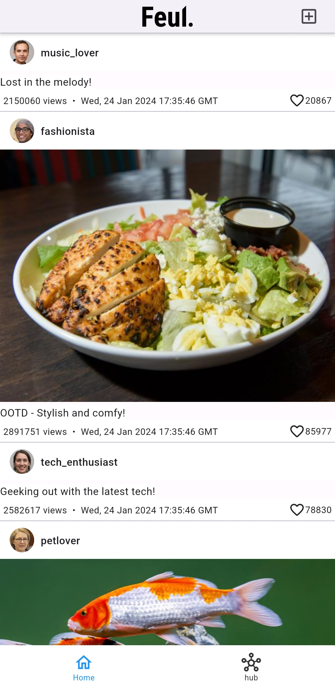

# fuel
Fuel App started with a simple idea. Connecting startups to investors and vice-versa. The idea is to allow our users to reach out to prospective investors or startups and build better services.
I wholeheartedly advocate for startups and entrepreneurs, fully aware of the exhilarating yet demanding journey they undertake. So, in order to make their life a little bit easier I started this project.
However at this time, I'm not sure if this app will ever go into production. 

## About App
This app is integrated with flask server hosted on AWS. The code for which can be found here. 
https://github.com/anupam1897/fuel_server

## Screenshots

  
  
  

  <em>HomePage</em>
  <em>HubPage_For You</em>
  <em>HubPage_seeded</em>

# Upcoming Features
- Accounts and Settings
- Chats
- Portfolio management Pages
- Firebase  & OAuth implementation
   
## For Recruiters
Thank you for considering Fuel for review! I believe that Fuel showcases my commitment to creating user-friendly and feature-rich Flutter applications. If you have any questions or need further information, please feel free to reach out to me. I'm  excited about the opportunity to discuss coding practices, design decisions, and the overall development process behind Fuel.

This app is fairly very new and  I'm passionate about continuous improvement, and ready to contribute to making Fuel even better. I believe in collaborating with a dynamic team and leveraging our skills to serve a broader audience and enhance the user experience. I would be excited to hear from you about possibilities of collaboration.

I appreciate your time and look forward to the possibility of working together.

Contact: anupam1897@gmail.com
